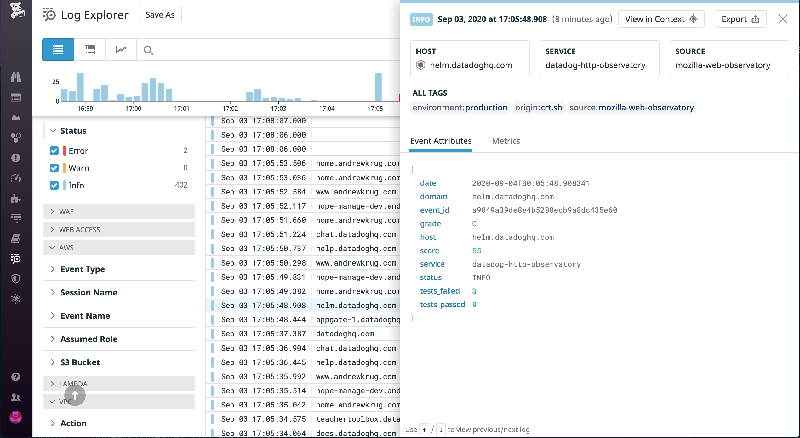

# datadog-http-observatory
A datadog integration to interact with the [Mozilla HTTP Observatory]('https://observatory.mozilla.org').  This unofficial integration uses AWS Step Functions to consume certificate transparency logs for your domains and then scan them using the Mozilla HTTP Observatory.  The web observatory checks for OWASP Top 10 vulnerabilities like missing CSP headers or lack of HSTS.

## Why?
This project exists to demonstrate the power of continuous auditing, open source, and the Datadog Platform's capabilities.  Many companies use a combination of open source and commercial software to enhance their security posture.  This small codebase could have a significant impact on the gamification of web security at your place of business.

## Requirements 
* AWS Account ( for running functions )
* Datadog Account for shipping metrics
* [AWS Serverless Application Command Line]('https://docs.aws.amazon.com/serverless-application-model/latest/developerguide/serverless-sam-cli-install.html')

## Features
* Consume certificate transparency logs
* Regularly scan websites using those transparency logs
* Ship normalized metrics regarding those scan events to Datadog

## License
Apache 2.0

## Getting Started

1. Select the domains you would like to scan.
2. Add them to AWS Parameter Store.  
    Example: 
    ```
    aws ssm put-parameter \
    --name "/datadog/observatory_scanner_domains/" \
    --type "StringList" \
    --value "xyz.com,example.com" \
    --overwrite 
    ```
    > Note you can add as many domain names as you would like comma-separated.
3. Add your Datadog API Key as a SecureString.  
    Example: 
    ```
    aws ssm put-parameter \
    --name "/datadog/observatory_dd_api_key" \
    --type "SecureString" \
    --value "YOUR_API_KEY" \
    --overwrite
    ```
4. Deploy the scanner using the AWS Serverless Application Cli.
   `sam build --use-container`
   `sam deploy --guided`
    This will confirm things like the region and plan for generating CloudFormation templates to setup the service.  At the end you should see:
    `Successfully created/updated stack - datadog-http-observatory in $AWS_REGION`

    > Note the output of the stateMachine ARN.  The output should look like the following:
    ```
    ------------------------------------------------------------------------------------------------------------------------------------------
    Outputs
    ------------------------------------------------------------------------------------------------------------------------------------------
    Key                 ObservatoryStateMachineArn
    Description         Observatory State machine ARN
    Value               arn:aws:states:us-west-2:671642278147:stateMachine:ObservatoryStateMachine-h0PqT27OzIn5
    ```
5. Sign into the AWS Console and enable the CloudWatch Event Trigger to run the scan on an hourly basis.  This is set in the `template.yml` to rescan every hour but you may change the value to more frequent scanning.

6. Try a manual execution of the state machine to run the job once.
    ```
    aws stepfunctions start-execution \
    --state-machine-arn YOUR_STATE_MACHINE_ARN \
    --name observatory-test \
    --cli-input-json {} 
    ```

A few minutes after this you should see your first set of scan results entering Datadog.  They will appear as `source: mozilla-web-observatory` in the log explorer.



### Metrics

The service also uses [DatadogPy]('https://github.com/DataDog/datadogpy') in order to create top level metrics on web security health for the organization.  You can see them in the metrics explorer in the `mozilla.*` metric namespace.

